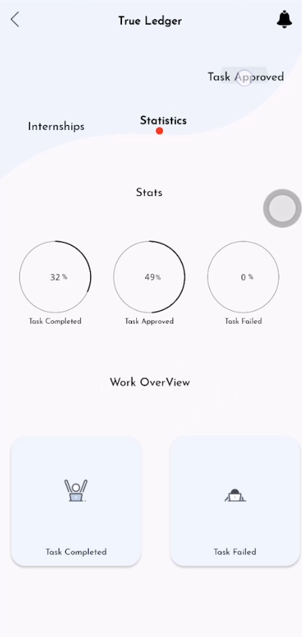

# True Ledger Android App
## Project Description

**True Ledger** is an Android application that allows users to perform various tasks and get paid for their efforts. Whether you're looking to earn extra income or need assistance with specific tasks, True Ledger provides a platform for both individuals and businesses to connect and collaborate seamlessly.

## Features

- **Task Creation**: Users can create tasks they need help with, specifying details such as task description, location, and budget.

- **Task Browsing**: Browse a list of available tasks in your area or based on your skills and interests.

- **Task Acceptance**: Taskers can review available tasks and choose to accept them based on their preferences.

- **Payment Integration**: Seamlessly manage payments within the app. Earn money by completing tasks or pay for services you need.

- **User Profiles**: Create and customize your profile to showcase your skills and build trust within the community.

- **Messaging**: Communicate with task posters or taskers within the app to coordinate details and exchange information.

## Screenshots

Here are some screenshots of the True Ledger app in action:

1. 
2. 
3. 
4. 
5. 

